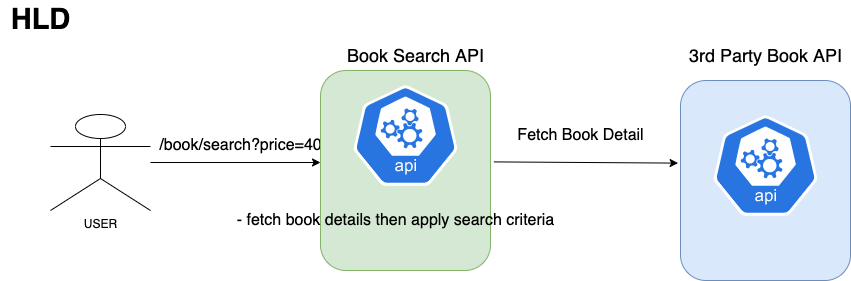
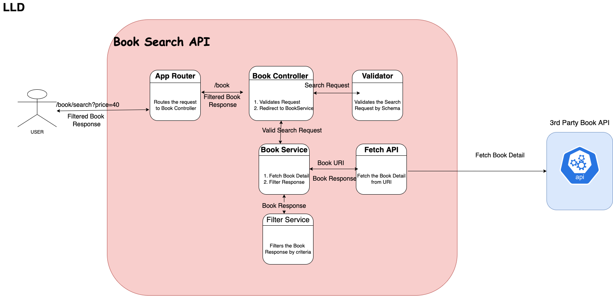

# book-search-api
Its objective is to provide book search api that provides book details from third party api after applying filter criteria given by the user.



## Requirements:

1. Design a Rest API backend.

2. It should fetch data from the given URI - 

   ```api
   https://run.mocky.io/v3/d7f02fdc-5591-4080-a163-95a08ce6895e
   ```

3. Rest API end point to be exposed as

   ```
   GET /book/search
   ```

4. Caller can specifiy SearchCriteria as Query parameter for all the fields mentioned in response

   ```
   'title',
   'isbn',
   'pageCount',
   'date',
   'price',
   'currency',
   'thumbnailUrl',
   'shortDescription',
   'status',
   'author',
   'category'
   ```

5. Create Unit Test cases.

6. Some sample API requests are below

   ```
   • /search?price=40. Will return 23 books.
   • /search?category=Java. Will return 30 books.
   • /search?date=2009-04-01&price=40. Will return 2 books.
   • /search?date=2011. Will return 6 books.
   ```

## Low Level Diagram:



## Tech used:

**Runtime environment**

- [x] Node.js

**API for books**

- [x] [3rd party Book Details API](https://run.mocky.io/v3/d7f02fdc-5591-4080-a163-95a08ce6895e)

**Programming Lnguage**

- [x] JavaScript

**Dependencies**

- [x] "express": "^4.17.1",
- [x] "node-fetch": "^2.6.1",
- [x]  "lodash": "^4.17.19",
- [x] "winston": "^3.1.0",
- [x] "winston-transport": "^4.2.0",
- [x] "boom": "^7.1.1",
- [x]  "@hapi/joi": "^17.1.1",
- [x] "@joi/date": "^2.1.0",
- [x]  "dotenv": "^8.2.0"
- [x] "chai": "^4.1.2",
- [x] "mocha": "^8.3.0",
- [x] "chai-http": "^4.0.0"
- [x]  "redis": "^2.8.0",
- [x]  "bluebird": "^3.5.1"

## How to install & run:

### Using Git (recommended)

1. Navigate & open CLI into the directory where you want to put this project & Clone this project using this command.

```bash
git clone https://github.com/anilkushwahammt/book-search-api.git
```

### Using manual download ZIP

1. Download repository
2. Extract the zip file, navigate into it & copy the folder to your desired directory

### Install npm dependencies after cloning or downloading

```bash
cd book-search-api
npm install
```

### Setting up environments

1. There is a file named `.env` on the root directory of the project. Set below details accordingly

   ```
   PORT=8080
   LOG_LEVEL=error
   BOOK_URI=https://run.mocky.io/v3/d7f02fdc-5591-4080-a163-95a08ce6895e
   ```

### Run the Redis Server

```bash
docker-compose up
```

### Run the project

```bash
npm start
```

You can be sure that the server is running by checking this output in the command window

```bash
> book-search-api@1.0.0 start
> node app

server running at port 8080 ...
```

In Browser Type

```
http://localhost:8080/
Book Search Service is Up and Running
```

Press `CTRL + C` to stop the server.

### Run Test cases 

```bash
npm test
```

You can be sure that all test cases should pass

```
 22 passing (14s)
```


